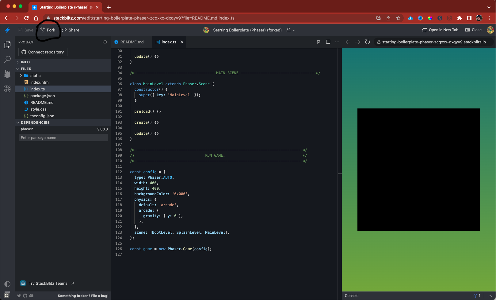
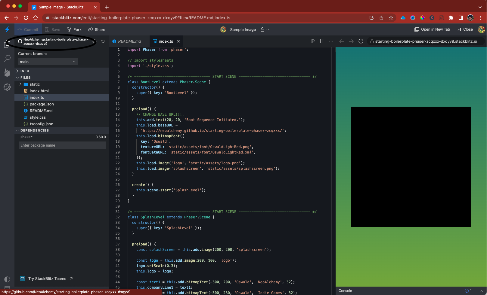
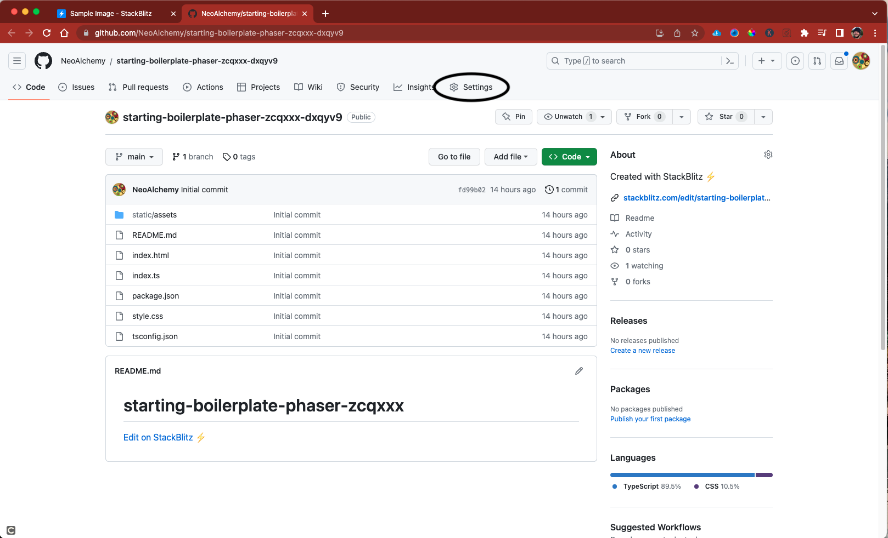
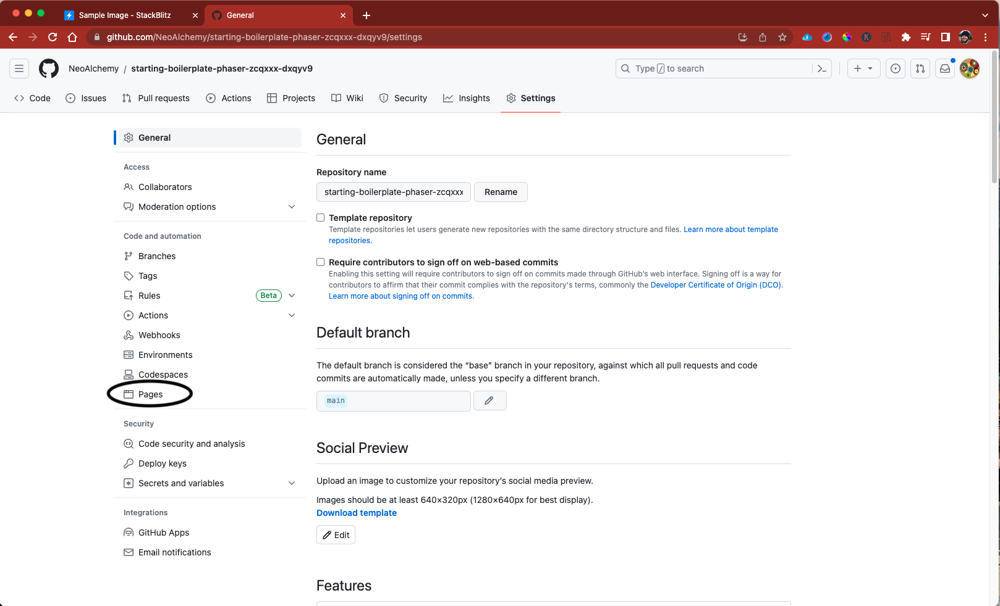
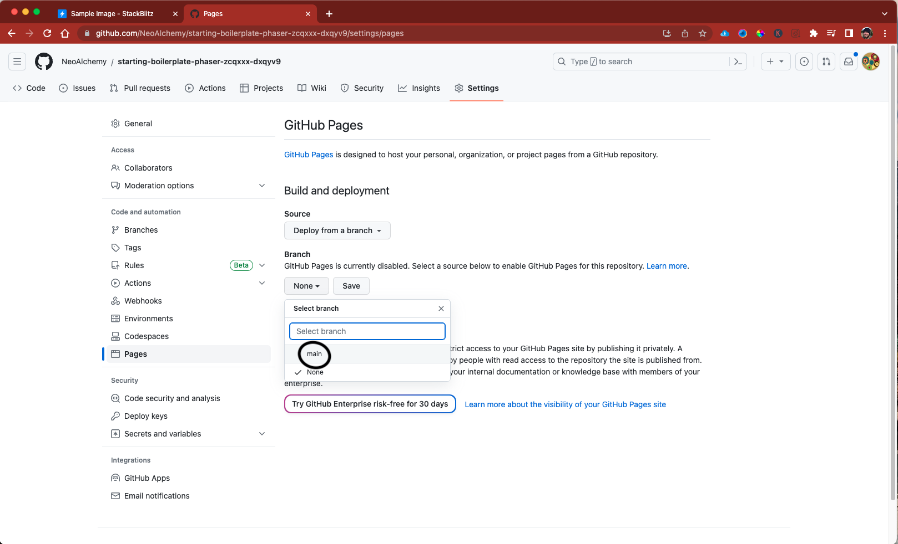
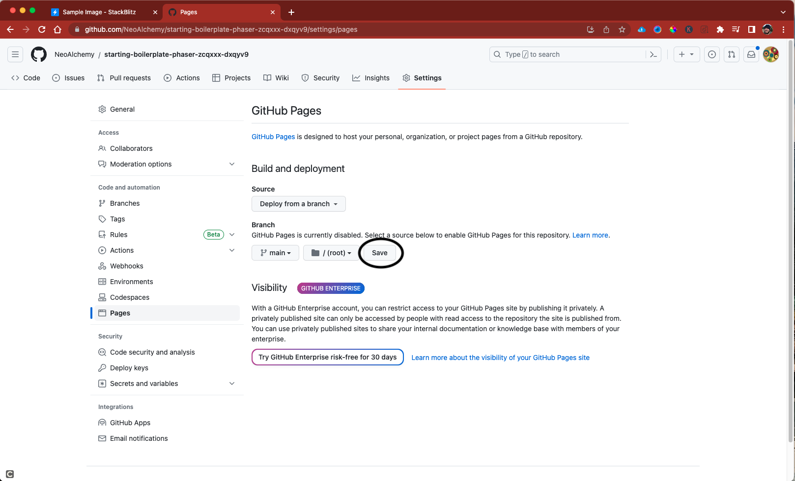
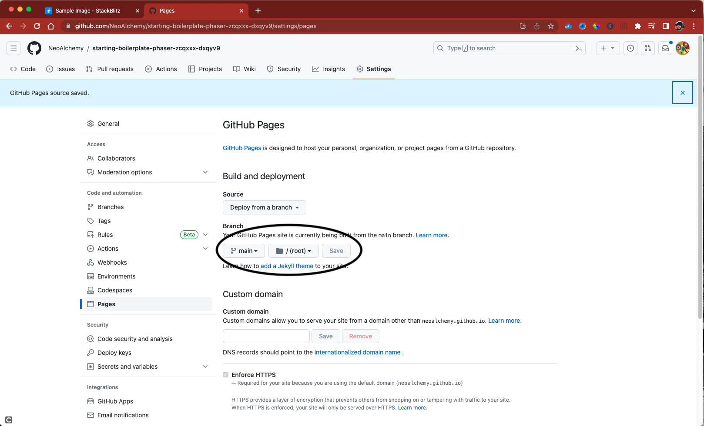
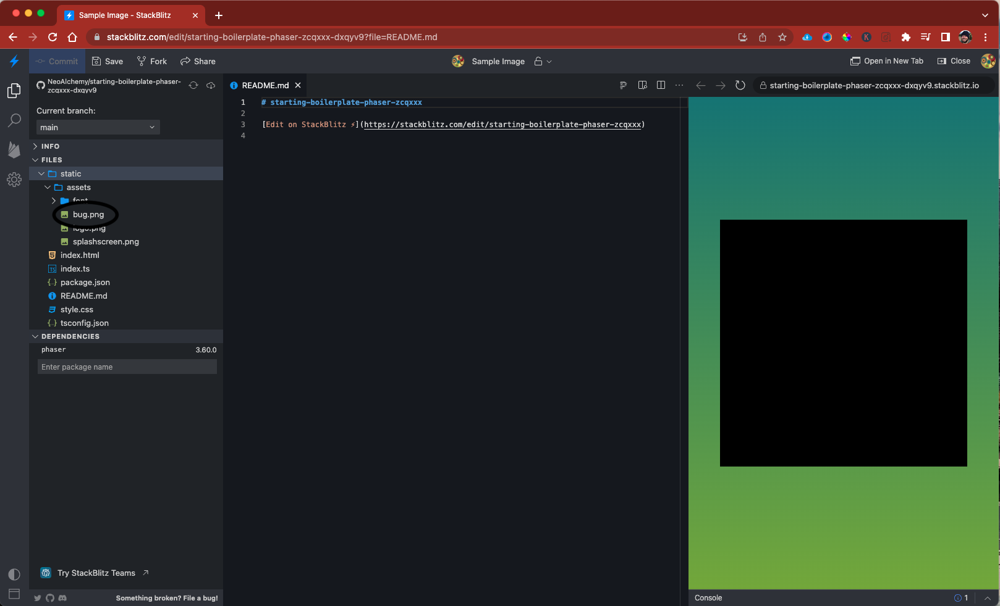
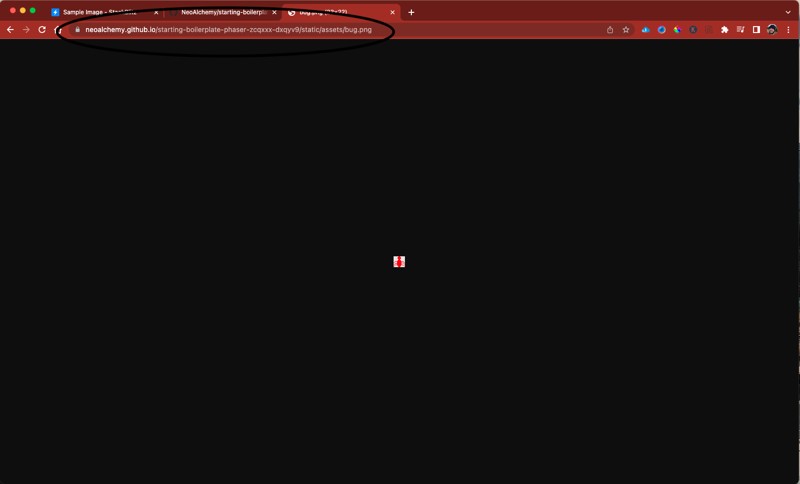
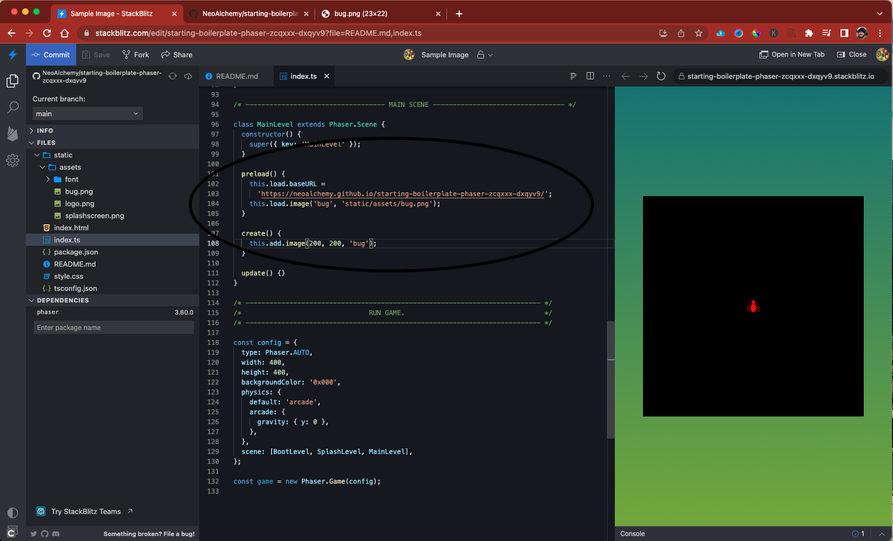

# How to load a sprite on a project

The boilerplate project is now working with Phaser 3 which is a JavaScript and TypeScript Game Development Framework.  Thinking of this as helpful as a coloring page is to painting.  However using images in StackBlitz means setting up your project to sync with GitHub.  It also means having GitHub sync with GitHub Pages.  These steps explain and show you how this works.

## Steps to displaying image

1. In your browser go to StackBlitz and visit the Starting Boilerplate Template.  Find the Fork button in the top left corner and click the button 

1. You will want to change the project metadata with a new project name, and url for viewing the project.  Refresh the page to have your project name changes take effect.  You will then want to connect to a GitHub repository.

1. You will see the GitHub repository name where the 'connect repository' button use to be.  That is a launchable link and you can click the link to go to the GitHub repository page.

1. In the repository go to the settings for the repository.

1. In the settings page for the repository click on the GitHub Pages link.  The link will be called 'pages'.

1. The GitHub Pages will allow you to save the code in the main branch and automatically publish them to the web for viewing. You will want to click on the branch drop down and select main.

1. When you have selected 'Main' branch then save your settings for the GitHub Pages.

1. You will see a message indicating that saving of settings was successful.

1. View your StackBlitz project that you have been working with.  Find the image file that you want to display and drag that over to StackBlitz project structure.  It is best to have a folder structure where you can save images that you are using in the game different then piskel files for modification later.

1. StackBlitz will sync the image with GitHub, especially when you choose the commit button.  GitHub will then start a process (under Actions) that will deploy the images to GitHub pages.  After about a minute or two you will see the image under the GitHub area.

1. Inside the index.ts there are a few code changes that you need to make.  First `this.load.baseUrl` sets up where the code can find the images.  `this.load.image` preloads the image file so that you can access it by key only.  `this.add.image` allows you to place the image to the `x` and `y` coordinates.

## Resources

Here is a few urls that may be helpful.  The first one is the starting boilerplate code that you can fork.

- [StackBlitz Starting Boilerplate Code](https://stackblitz.com/edit/starting-boilerplate-phaser-zcqxxx)

