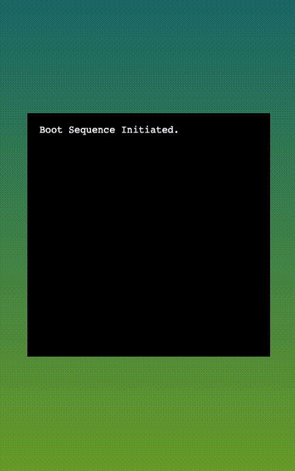
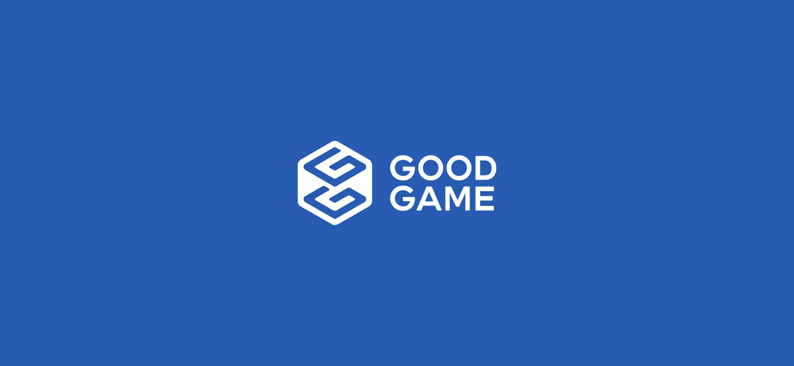
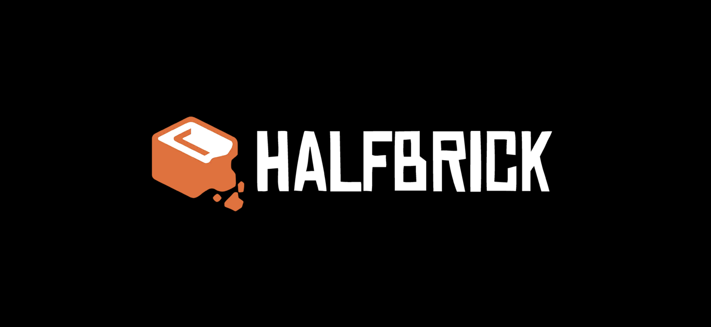
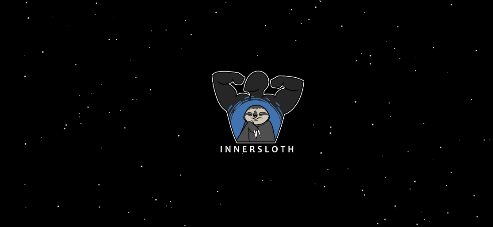
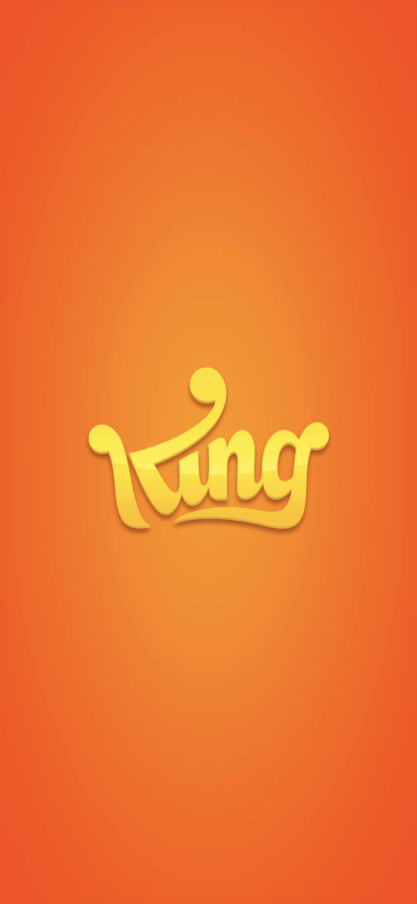
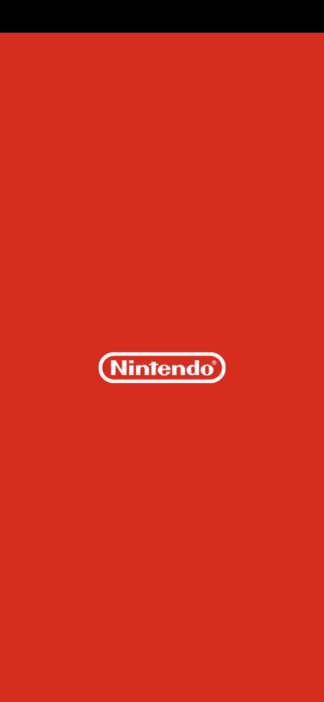
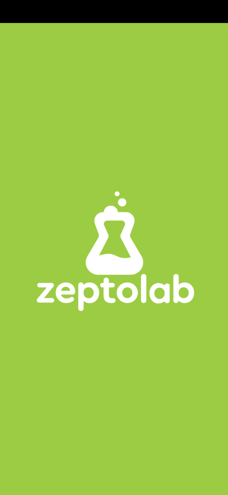

We will make some splash screens for the games that you will be coding.  Splash Screens are a way to display your "Company's Logo and Name".  For your design thinking of some good colors, fun logo and fun company name.

>Here is my splash screen.

## Elements of the Splash Screen to consider

### Logo

You can find logo's by searching up on google the image you prefer.  I recommend adding keywords with the search.  Add the words `Vector Logo Free`.  So a lion would be `Lion Vector Logo Free`.

### Name

NeoAlchemy has meaning to me as a handle i've used before.  Perhaps you have one, or a phrase, or a random word.  Or if you use ChatGPT, describe yourself or your mission with gaming and what would be good gaming company name.

### Colors

From the logo you use you can go to some sites that extract main colors from the logo and use one of those main or complementry colors as a background.  I would recommend the site: [Color Adobe Image](https://color.adobe.com/create/image).  

### Font

Find a font that you like and add use that font with your image.  Ask google to recommend fonts.  For instance perhaps `bold game google fonts` or `SciFi game google fonts`.  

### Backgrounds

Sometimes they are one solid color.  Other times there is a gradient going on.  I found a site that lets you create a gradient background image that you can use for the logo.  [Gradient to Image](https://mdigi.tools/gradient-generator/)

### Music

If you really want to there is a way to add a 'startup sound' to the splash screen.  I don't usually recommend this as most people perfer to turn the sound on for games then have the sound be playing already.

### Movement

You can have text and logos fly in, fade in, and even bounce in.  You can do whatever you want.

> Sketch out on paper what your splash screen design would look like.

## Examples

## Challenge

If you can bring me a paper with what popular mobile phone game the example splash screens created I will reward you with a large candy bar!!!

## Resources

- [Color Adobe Image](https://color.adobe.com/create/image)
- [Gradient to Image](https://mdigi.tools/gradient-generator/)
