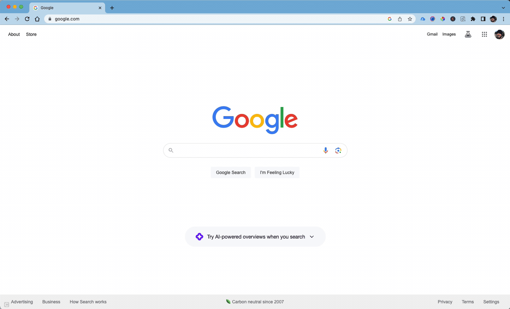
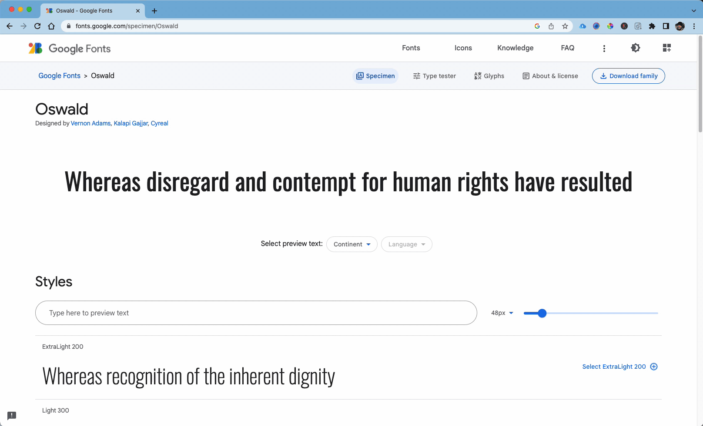
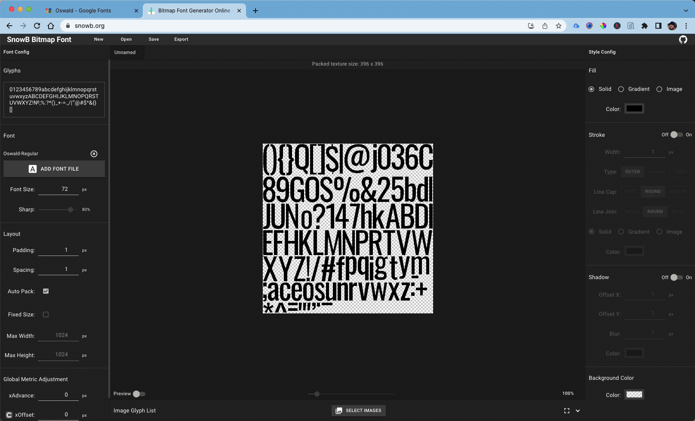
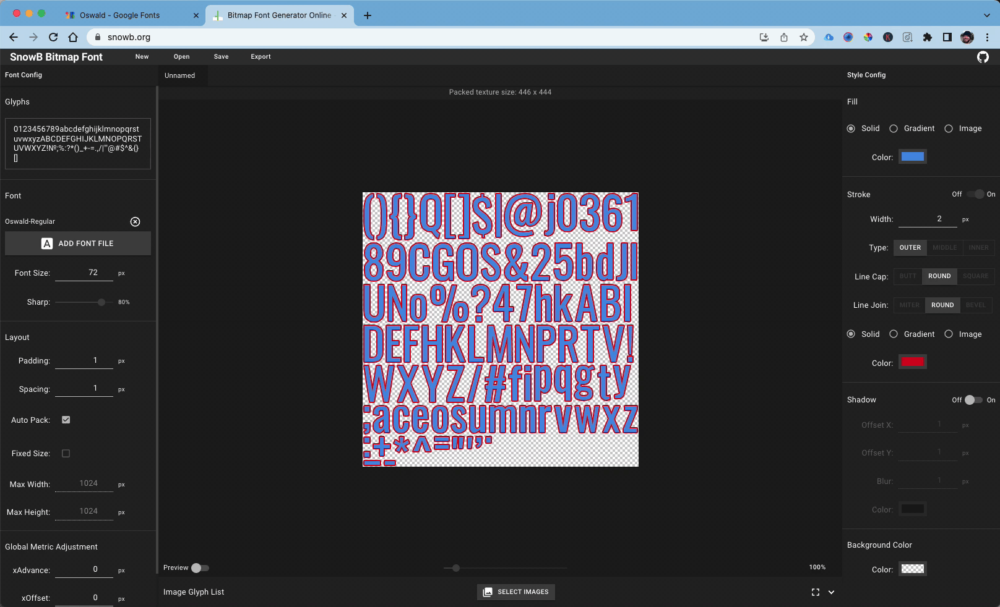
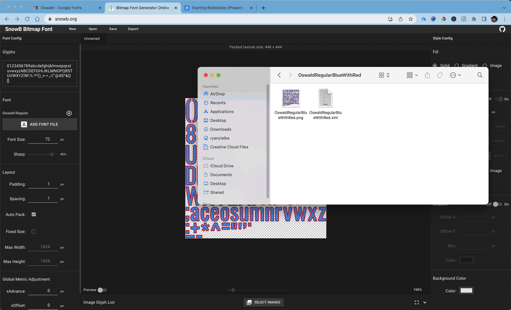

Sometimes we want to make a font available offline instead of having to wait for Google Fonts or another CSS Font file to load.  One of the ways to do this is to create a Bitmap Font.  The other advantage of having a Bitmap font is that the performance is faster.  This helps with things like startup screens, or places where the font is used a lot of places.

## Creating and Using a Bitmap Font

1. **Create a bitmap font from Google**.  First you should go to the web and search for a font that you prefer.  If you want the font file to be from Google Fonts then include `Google Fonts` in your search term.  For me I prefer Oswald for my "fake company" name.


1. **Download the font family**.  Secondly, you should then find the way the website is asking for you to download the font file.  For google fonts there is a `download family` button in the top right hand side.


1. **Open font file in a bitmap creater**.  Third, you should then open the font file in a bitmap maker, like SnowB.  You would launch the [SnowB.org Website](https://snowb.org/) and then click on find file button on the left hand side navigation bar.


1. **Design the font colors, outlines and shadows**.  The right hand navigation allows you to modify the colors, outline and shadow of the font to what you need the design to be.  For purposes of demo we will change the color of the font and outline.


1. **Export the bitmap font files**.  For Phaser 3, the Game Development Framework we will be using, you will need to export the files to be xml.  Name the font something unique so that if you need other types of font designs and colors you wont have name collisions.


1. **Load Font Files to Project**.  Go to StackBlitz.  For my projects, I like to create a seperate folder for my font files.  I would then drag the image and xml file that I downloaded from SnowB and Drop them in the new folder I created.


1. **Files will automatically be uploaded to GitHub Pages**.  Hopefully by this time your StackBlitz project has a GitHub repository.  Also that the GitHub repository has settings changed for GitHub Pages.  If not go to the [Load Sprite blog article](https://neoalchemy.github.io/intro-to-game-programming-2023/blog/load-sprite) and do steps 2 - 8.

1. **Code to allow bitmap files to load**.  The code for preloading a font file is the following

```js
this.load.baseURL = 'https://neoalchemy.github.io/starting-boilerplate-phaser-zcqxxx/';
this.load.bitmapFont({
    key: 'OswaldRegBlueRed',
    textureURL: 'static/assets/font/OswaldRegularBlueWithRed.png',
    fontDataURL: 'static/assets/font/OswaldRegularBlueWithRed.xml',
});
```

The code for creating a text box with the bitmap file and your desired text is the following

```js
const text1 = this.add.bitmapText(200, 200, 'OswaldRegBlueRed', 'Your Text', 32);
```


## Resources

- [Color Adobe Image](https://color.adobe.com/create/image)
- [Gradient to Image](https://mdigi.tools/gradient-generator/)
