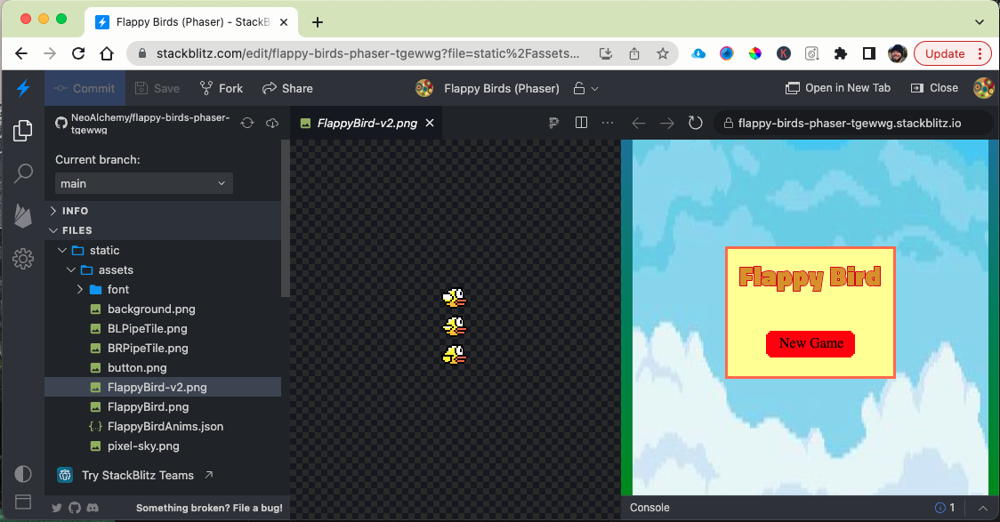
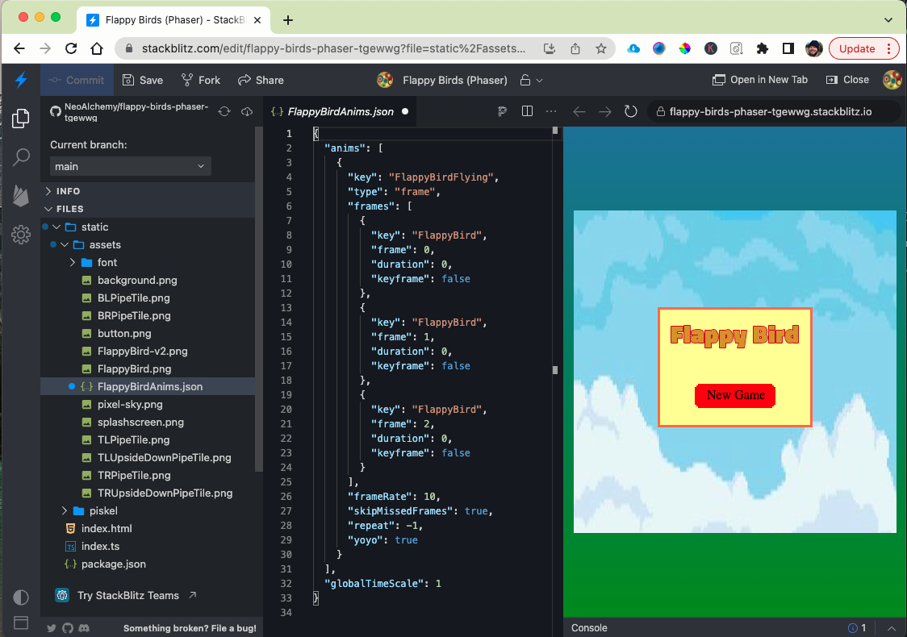

If you want to load an animation, you need to setup an animation file.  In order to do this you need to have a piskel spritesheet with an animation file.



In order to do an animation file you will need to do the following:

1. Create a json file inside the assets folder of StackBlitz

1. Add the following content.  Below is an example:



I will breakdown in detail how you modify your own animation file to work for you.

> NOTE: that json stands for JavaScript Object Notation.  A way to represent a lot of variables in one place

```js
{
  "anims": [
    {
      "key": "FlappyBirdFlying", // Change this to what you want to call the anmiation
      "type": "frame",
      "frames": [
        {
          "key": "FlappyBird", // This is the key name for the png file that you loaded
          "frame": 0,     // this is the first frame, or the top image in the column
          "duration": 0,
          "keyframe": false
        },
        {
          "key": "FlappyBird",  // same key name of png file
          "frame": 1,  // this is the second frame, or the second image in the column
          "duration": 0,
          "keyframe": false
        },
        {
          "key": "FlappyBird",  // key name of png
          "frame": 2,  //third frame
          "duration": 0,
          "keyframe": false
        }
      ],
      "frameRate": 10,  // How fast do you want the frame rate
      "skipMissedFrames": true,
      "repeat": -1,  // do you want the animation to repat from top?
      "yoyo": true  // do you want the animation to go backwards when finished?
    }
  ],
  "globalTimeScale": 1
}
```

Now that you have the files you need it is time to code the files.

1. First, preload the files in the `Splash Level` `preload` function.

```ts
// note that the key like above is FlappyBird
// the second parameter is the image
// the third parameter is an object 
// starting and ending with curly braces indicating frame width and height
this.load.spritesheet('FlappyBird', 'static/assets/FlappyBird.png', {
    frameWidth: 32,
    frameHeight: 32,
});

// Next you are loading the json file under a key, this one called FlappyBirdAnims
this.load.animation('FlappyBirdAnims', './static/assets/FlappyBirdAnims.json');
```

2. Second, under the `Main Level` `create` function is where you will add code for the sprite and play animation.

```ts
const flappyBird = this.physics.add.sprite(100, 200, 'FlappyBird', 0);
flappyBird.anims.play('FlappyBirdFlying'); // notice the key for animation
```
